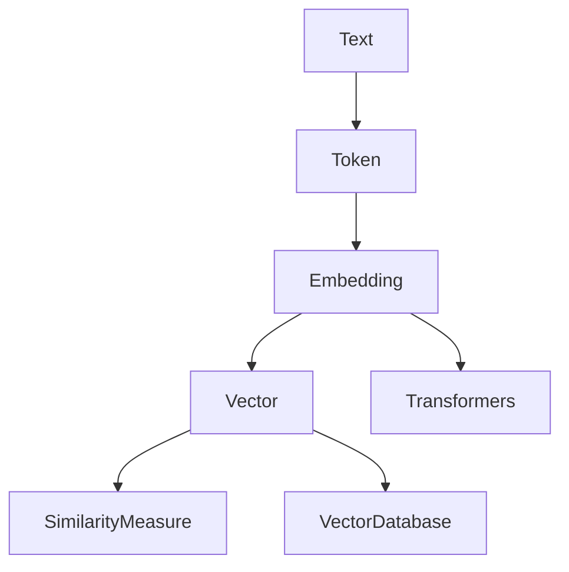

# Introdcution

## Breaking down texts

## Modelling

- *Attention* captures context.
- *Billions* of parameters.
- **Huge** training data.
- Training is **expensive** and requires specialized hardware.
- RLHF to incorporate *human feedback*.
- Fine-tuning at the hands of the customer <!-- is this RAG? -->

## Limitations

- Math / logic / reasoning
- Training data:
    - Bias
    - Cut-off date
- Censorship by some vendors
- Hallicunation
- computationally expensive
- Ethics and copyright issues
